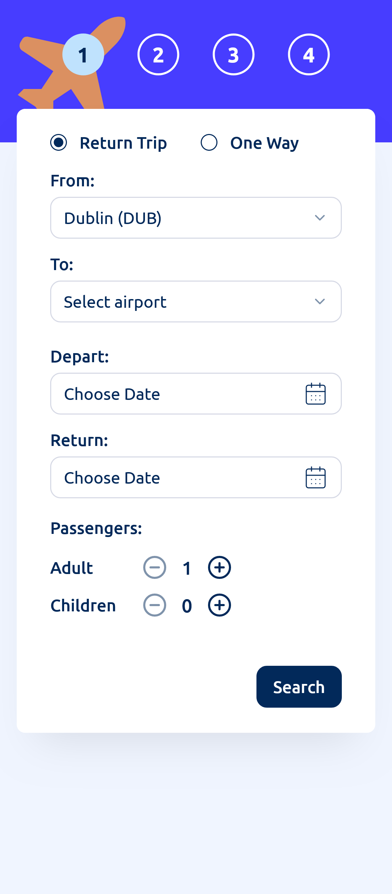

## Flight Booking App

This is a Flight Booking App. With real time flights using Duffel API.

## Table of contents

- [Usage](#usage)
- [Overview](#overview)
  - [Screenshots](#screenshots)
  - [Folder Structure](#folderstructure)
  - [Links](#links)
- [My process](#my-process)
  - [Built with](#built-with)
- [Author](#author)

## Usage

1. Clone the repository.
2. Install dependencies using `npm install`.
3. Set up environment variable.
4. Run the app using `npm start`.

## Overview

### Screenshots

#### Desktop


#### Mobile



### Folder Structure

```
/flights-booking-app
├─ public
├─ src
│  ├─ components
│  ├─ data
│  ├─ hooks
│  ├─ lib
│  ├─ providers
│  ├─ routes
│  ├─ App.tsx
│  ├─ index.css
│  ├─ main.tsx
│  └─ vite-env.d.ts
├─ .env
├─ .eslintrc.cjs
├─ .gitignore
├─ components.json
├─ index.html
├─ package.json
├─ package-lock.json
├─ postcss.config.js
├─ README.md
├─ tailwind.config.js
├─ tsconfig.json
├─ tsconfig.node.json
└─ vite.config.ts
```

#### Explanation

### Links

- Live Site URL:
  [https://booking-flight-app-sergio.netlify.app/](https://booking-flight-app-sergio.netlify.app/)

- Server repository
  [https://github.com/Sergio0831/flight-booking-api](https://github.com/Sergio0831/flight-booking-api)

## My process

### Built with

- Semantic HTML5 markup
- Flexbox
- CSS Grid
- Mobile-first workflow
- [React](https://react.dev/) - JS library
- [TypeScript](https://www.typescriptlang.org/) - Programming Language
- [Axios](https://axios-http.com/) - Promise based HTTP client, used for data fetching
- [React Query](https://tanstack.com/query/latest/) - Powerful asynchronous state management
- [Shadcn/UI](https://ui.shadcn.com/) - Components library
- [Tailwind CSS](https://tailwindcss.com/) - A utility-first CSS framework
- [Tailwind CSS](https://tailwindcss.com/) - A utility-first CSS framework
- [date-fns](https://date-fns.org/) - JavaScript date utility library
- [Lucide](https://lucide.dev/) - Icon toolkit

## Author

- Website - [Sergejs Ivcenko](https://sergejs-ivcenko.com/)
- GitHub - [Sergio0831](https://github.com/Sergio0831)
- LinkedIn - [ivcenko](https://www.linkedin.com/in/ivcenko/)
